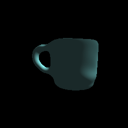

### Build
```console
mkdir build
cd build
cmake -DCMAKE_BUILD_TYPE=Release ..
make test_siren
```


### Run Tests 
```console
./test_siren
```

Results you can find in siren_cpu/results


### Score
1. SIREN implementation - 10 
2. SIREN visualisation - 5

Total: 15

### Example 

